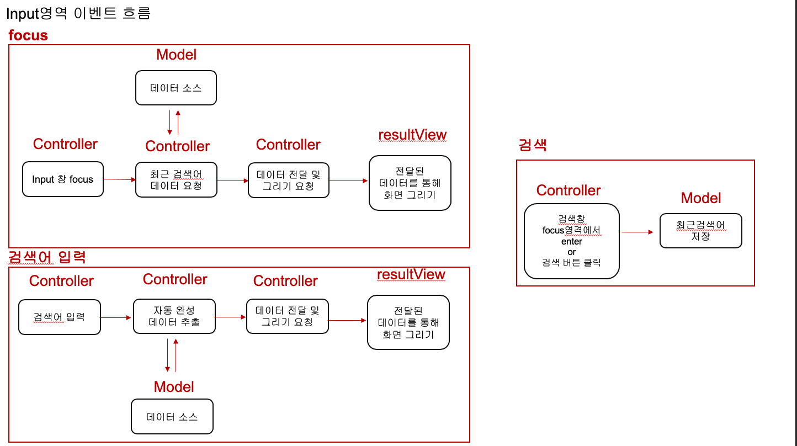
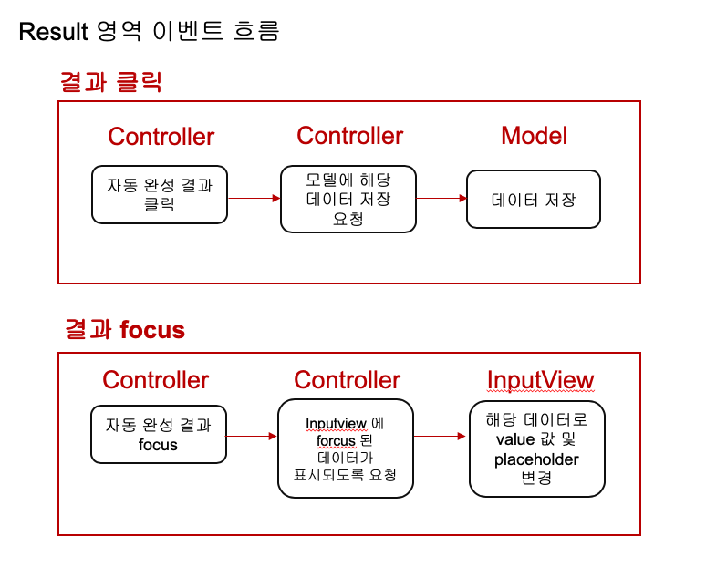

# 검색완성 설계

## 역할들 

- 이벤트 알려서 특정 로직 실행하게 하기 
- 화면 그리기 
- 데이터(상태) 저장
- 데이터 처리
- 기타 키보드 이벤트

## 변화율이 높은 역할들 

- 화면을 어떻게 그려야하는지(받아들이는 데이터에 따라, template code가 달라짐)
  - template 함수를 옵션으로 받아서 변화에 잘 대응하게 하기 
- 어떤 데이터가 어떻게 들어올지 데이터 추출 및 처리에 대한 함수를 옵션으로 받자
- 여기서 option을 어떻게 구현해야하는가? 
  - 추상 class 를 상속 받아서 overriding
  - 해당 함수를 옵션으로 받아서 처리 
  - 뭐가 좋은지는 잘 모르겠음 

## 이벤트 흐름과 역할 할당

 

 

- 만들고 보니 Controller가 비대하게 크고 복잡도를 controller를 가지고 있다. 

